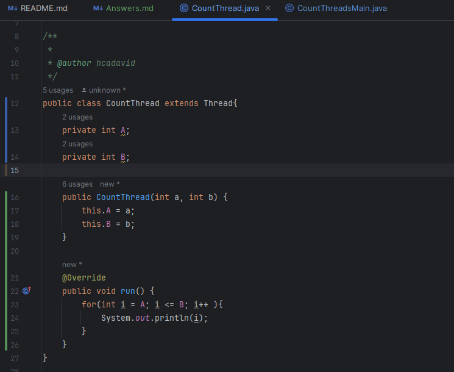
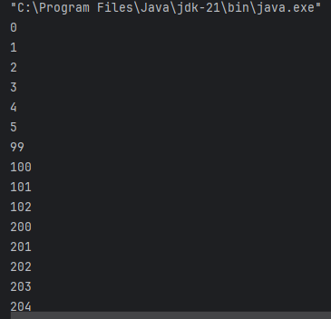
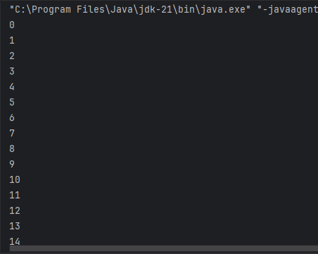
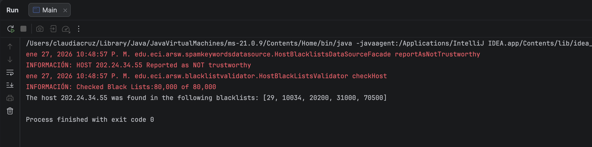
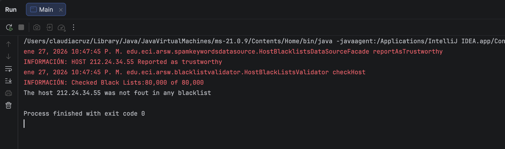
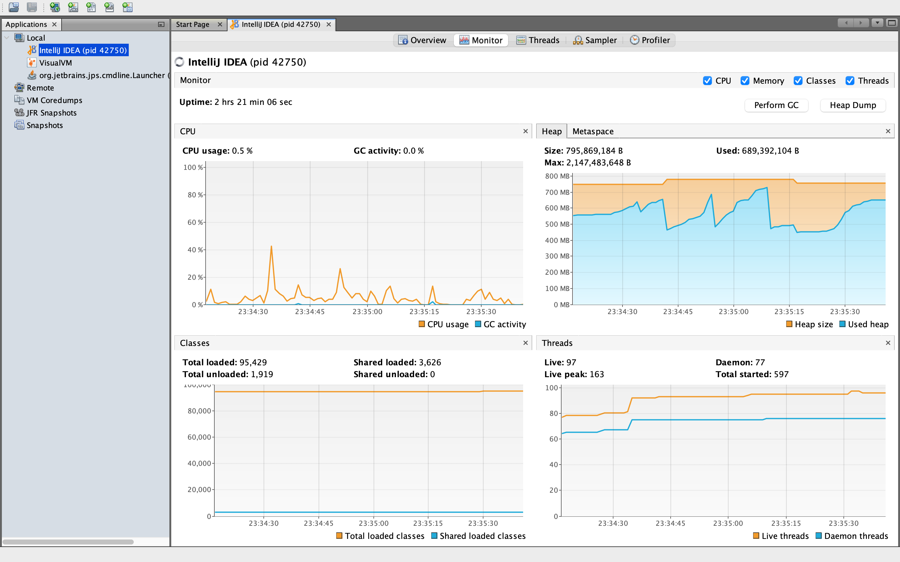
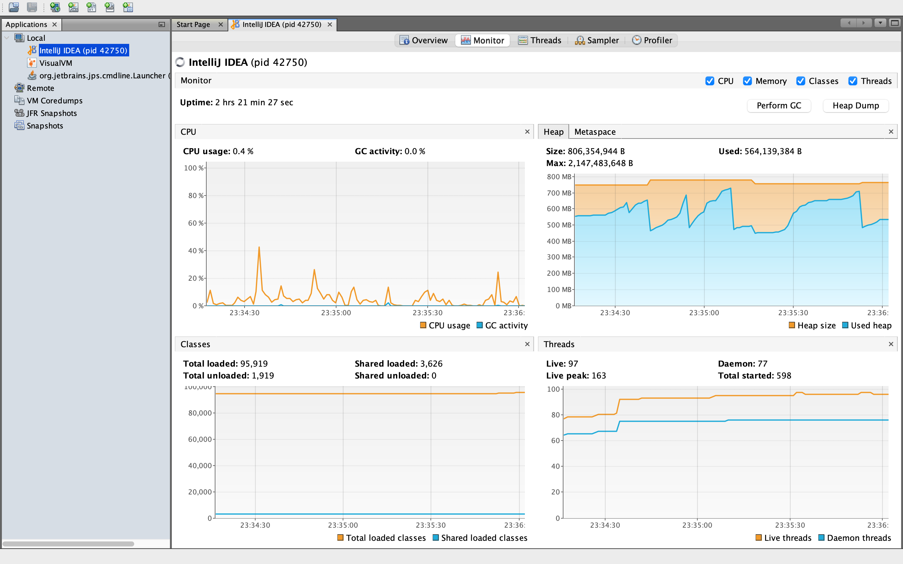
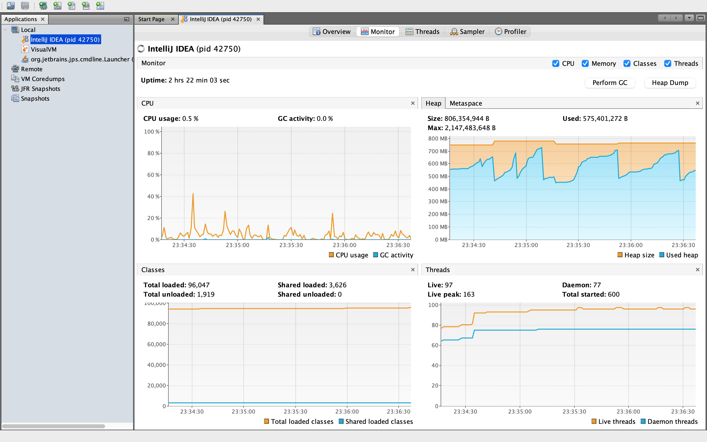

# Laboratorio 1 - Arquitectura de Software
## Ejercicio Introducción al paralelismo - Hilos - Caso BlackListSearch

**Elaborado por:**
Juan Carlos Leal Cruz

___

### Parte 1. Introducción a Hilos en Java

1. A continuación adjunto la evidencia de la creación de la clase CountThread

2. Al completar el metodo main de la clase CountThreadsMain se realizaron ambas pruebas, tanto usando run como start y se obtuvo lo siguiente:
   1. **Con ``.start()``**
      
   
   
   3. **Con ``.run()``**
      
   
   
   4. **¿Cómo cambia la salida? ¿Por qué?**
      La salida cambia en la medida en que con start() la cuenta de los hilos sale de forma aleatoria tal como se evidencia en la imagen, mientras que haciendo uso de run() la cuenta sale completamente en orden.
   Lo anterior ocurre debido a que el método start funciona creando un hilo independeinte, de tal forma que cada hilo se ejecuta en paralelo y se imprimen los números conforme el sistema va ejecutando; por otro lado, run() se ejecuta sobre un hilo principal, de tal forma que es secuencial y por ello primero se ejecuta el hilo #1 para luego continuar con el siguiente

___

### Parte 2. Ejercicio Black List Search
En este caso para la correcta ejecución de este punto del laboratorio se hizo uso de una lógica bastante parecida a la de la parte 1 a la hora de hacer las cuentas, solo que en este caso los intervalos se definieron según la cantidad de servidores y la cantidad de hilos que desea el usuario.

Por otro lado, se hace uso de ``.join()`` para que al final se entreguen los casos de ocurrencias de forma correcta, de tal manera que cada aun cuando se crean hilos en paralelo, se espera a cada hilo finalice para entregar los resultados, permitiendo que en caso tal de que un hilo temrine primerp que otro, no se le de al usuario la respuesta de una vez, sino que se espera a que cada lista negra sea recorrida.

#### Caso IP 202.24.34.55


#### Caso IP 212.24.24.55


#### Discusión: Cómo mejorar el número de consultas
La implementación se puede modificar incorporando una condición de parada temprana compartida, de manera que los hilos detengan la búsqueda cuando, en conjunto, se alcance el número mínimo de ocurrencias necesarias para clasificar un host como malicioso. Esto evita que se sigan realizando consultas innecesarias a las listas negras una vez cumplido el objetivo.

Este cambio introduce la sincronización y coordinación entre hilos, ya que es necesario manejar un estado compartido de forma segura para garantizar consistencia y visibilidad de la información durante la ejecución. Por lo anterior se hace uno de un controlador que utiliza ``synchronized`` en sus métodos para garantizar que todos los hilos se "comuniquen" así:
```
public synchronized boolean stopSearch() {
        return stop;
    }

    public synchronized void reportOccurrence() {
        totalOccurrences++;
        if (totalOccurrences >= 5) {
            stop = true;
        }
    }
```
___

### Parte 3. Evaluación de Desempeño






---
### Parte 4. Ejercicio Black List Search
#### 1. ¿Por qué el mejor desempeño no se logra con 500 hilos?
Aunque la Ley de Amdahl indica que más hilos deberían mejorar el desempeño:

- No todo el programa se puede paralelizar (parte secuencial \(1-P\)).
- Muchos hilos generan overhead, lo cual implica sincronización, cambios de contexto y competencia por recursos.
- Por eso, usar 500 hilos en una máquina con pocos núcleos no mejora el tiempo total y puede incluso empeorarlo.
- Con 200 hilos ocurre lo mismo, mejora respecto a pocos hilos, pero ya se alcanza un límite práctico.

#### 2. Comparación: tantos hilos como núcleos vs. doble de núcleos
- Tantos hilos como nucleos del procesador: Cada hilo tiene su núcleo, máxima eficiencia de CPU.
- Tantos hilos como el doble de nucleos del procesador: Los hilos adicionales compiten por los mismos núcleos y generan overhead.

La conclusión es que, con más hilos que núcleos no significa mejor desempeño en CPU-bound tasks.

#### 3. Distribución en múltiples máquinas
- 100 máquinas con un 1 hilo por máquina: Cada hilo se ejecuta independientemente, casi sin overhead, cumpliendo mejor la Ley de Amdahl.
- 100/c máquinas con c hilos por máquina: Todavía hay competencia por cores locales, pero se mejora respecto a muchos hilos en una sola máquina.

