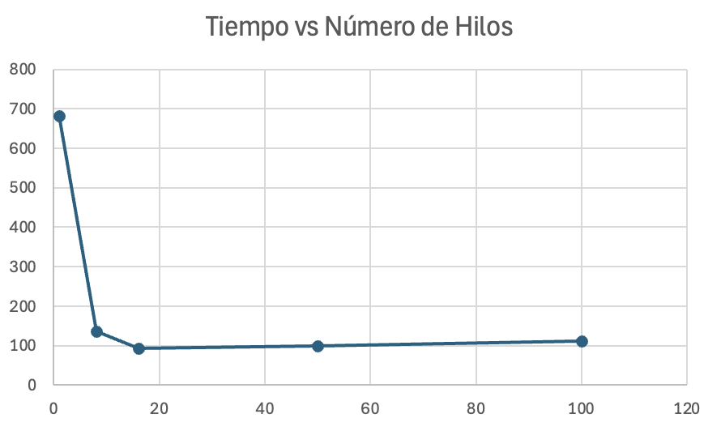

# Laboratorio 1 - Arquitectura de Software
## Ejercicio Introducción al paralelismo - Hilos - Caso BlackListSearch

**Elaborado por:**
Juan Carlos Leal Cruz

___

### Parte 1. Introducción a Hilos en Java

1. A continuación adjunto la evidencia de la creación de la clase CountThread

2. Al completar el metodo main de la clase CountThreadsMain se realizaron ambas pruebas, tanto usando run como start y se obtuvo lo siguiente:
   1. **Con ``.start()``**
      
   
   
   3. **Con ``.run()``**
      
   
   
   4. **¿Cómo cambia la salida? ¿Por qué?**
      La salida cambia en la medida en que con start() la cuenta de los hilos sale de forma aleatoria tal como se evidencia en la imagen, mientras que haciendo uso de run() la cuenta sale completamente en orden.
   Lo anterior ocurre debido a que el método start funciona creando un hilo independeinte, de tal forma que cada hilo se ejecuta en paralelo y se imprimen los números conforme el sistema va ejecutando; por otro lado, run() se ejecuta sobre un hilo principal, de tal forma que es secuencial y por ello primero se ejecuta el hilo #1 para luego continuar con el siguiente

___

### Parte 2. Ejercicio Black List Search
En este caso para la correcta ejecución de este punto del laboratorio se hizo uso de una lógica bastante parecida a la de la parte 1 a la hora de hacer las cuentas, solo que en este caso los intervalos se definieron según la cantidad de servidores y la cantidad de hilos que desea el usuario.

Por otro lado, se hace uso de ``.join()`` para que al final se entreguen los casos de ocurrencias de forma correcta, de tal manera que cada aun cuando se crean hilos en paralelo, se espera a cada hilo finalice para entregar los resultados, permitiendo que en caso tal de que un hilo temrine primerp que otro, no se le de al usuario la respuesta de una vez, sino que se espera a que cada lista negra sea recorrida.

#### Caso IP 202.24.34.55


#### Caso IP 212.24.24.55


#### Discusión: Cómo mejorar el número de consultas
La implementación se puede modificar incorporando una condición de parada temprana compartida, de manera que los hilos detengan la búsqueda cuando, en conjunto, se alcance el número mínimo de ocurrencias necesarias para clasificar un host como malicioso. Esto evita que se sigan realizando consultas innecesarias a las listas negras una vez cumplido el objetivo.

Este cambio introduce la sincronización y coordinación entre hilos, ya que es necesario manejar un estado compartido de forma segura para garantizar consistencia y visibilidad de la información durante la ejecución. Por lo anterior se hace uno de un controlador que utiliza ``synchronized`` en sus métodos para garantizar que todos los hilos se "comuniquen" así:
```
public synchronized boolean stopSearch() {
        return stop;
    }

    public synchronized void reportOccurrence() {
        totalOccurrences++;
        if (totalOccurrences >= 5) {
            stop = true;
        }
    }
```
___

### Parte 3. Evaluación de Desempeño
Como parte de lo requerido por el laboratorio, se realizan cinco experimentos para poder probar el desempeño del programa, a continuación vemos los resultados:

1. **Con un solo hilo**
   
   Como podemos ver en la imagen hay momentos donde se ve un pico de uso de CPU, lo cual tiene sentido ya que estamos delegando toda la tarea a un único hilo, por lo cual se ejcuta todo de forma secuencial en lugar de en paralelo. Por otro lado el tiempo de ejecución fue 751 ms según lo reportado por IntelliJ usando ``currentTimeMillis()``
   
2. **Con tantos hilos como núcles tiene el procesador**
   
   En este caso vemos que no hay unos picos tan pronunciados, sino que por el contrario todo se ve más regulado en la gráfica de uso de CPU. De igual forma el tiempo de ejecución reportado por IntelliJ usando ``currentTimeMillis()`` fue de 168ms, lo cual es un gran avance respecto al tiempo que tomó la búsqueda con un solo hilo y hace sentido si tomamos en cuenta que en este instante esa búsqueda se hace en paralelo y por ende es más rápida que algo secuencial.

3. **Con tantos hilos como el doble de núcleos del procesador**
   
   En este caso vemos en la gráfica de CPU que los picos de uso se presentan hacia el inicio, pero al final se regula bastante. En este caso, tel tiempo de ejecución reportado por IntelliJ usando ``currentTimeMillis()`` fue de 128ms y esto se entiende debido a que tenemos más hilos realizando la tarea en conjunto.

4. **Con 50 hilos**
   
   Para la cantidad de hilos seleccionada, podemos evidenciar que la gráfica presenta varios picos, lo cual nos indica que la CPU está siendo mucho más usada respecto a los otros casos, puesto que en fotos anteriores vemos normalmente 2 picos pero en este caso vemos 3. El tiempo de ejecución reportado por IntelliJ usando ``currentTimeMillis()`` fue de 125ms lo cual representa una mejora con respecto a lo que se venía obteniendo en tiempo.

5. **Con 100 hilos**
   
   En este caso vemos una gráfica bastante parecida a la anterior, de tal forma que podemos indicar que el uso de CPU es similar. Para este caso puntual, el timepo de ejecución reportado por IntelliJ usando ``currentTimeMillis()``  fue de 143ms, lo cual nos indica que aun así, teniendo más hilos, no ejecuta en un menor tiempo y esto se puede deber a que al tener una cantidad considerable de hilos es más compleja la carrera por uso de recursos y sincronización.

#### Tabla de Resultados y gráfica
Para lograr establecer unos resultados coherentes y óptimos lo que se hizo fue ejecutar el programa con cada número de hilos cinco veces para así obtener un promedio y no solo enfocarnos en un resultado único puesto que si se ejcuta una única vez, los resultados se peuden ver afectados por la introducción de ruido al momento de procesar las tareas.

**Host evaluado:** `202.24.34.55`

| Número de hilos | Tiempo promedio (ms) |
|-----------------|----------------------|
| 1               | 683                  |
| 8               | 137                  |
| 16              | 92                   |
| 50              | 98                   |
| 100             | 111                  |


Ahora bien, con estos resultados procedimos a hacer una gráfica de tiempo solución vs número de hilos, la cual resultó así:


Con la gráica y los resultados, se evidencia que, con el uso de múltiples hilos, se mejora significativamente el tiempo de ejecución del algoritmo en comparación con la versión secuencial. El mejor desempeño se alcanza con 16 hilos, donde se logra un aprovechamiento eficiente de los recursos del procesador. Sin embargo, al incrementar aún más el número de hilos, el tiempo de ejecución deja de disminuir e incluso aumenta ligeramente, debido al overhead asociado a la creación, coordinación y sincronización de hilos. Esto demuestra que existe un límite práctico al paralelismo y que un mayor número de hilos no garantiza un mejor rendimiento.

---
### Parte 4. Ejercicio Black List Search
#### 1. ¿Por qué el mejor desempeño no se logra con 500 hilos?
Aunque la Ley de Amdahl indica que más hilos deberían mejorar el desempeño:

- No todo el programa se puede paralelizar (parte secuencial \(1-P\)).
- Muchos hilos generan overhead, lo cual implica sincronización, cambios de contexto y competencia por recursos.
- Por eso, usar 500 hilos en una máquina con pocos núcleos no mejora el tiempo total y puede incluso empeorarlo.
- Con 200 hilos ocurre lo mismo, mejora respecto a pocos hilos, pero ya se alcanza un límite práctico.

#### 2. Comparación: tantos hilos como núcleos vs. doble de núcleos
- Tantos hilos como nucleos del procesador: Cada hilo tiene su núcleo, máxima eficiencia de CPU.
- Tantos hilos como el doble de nucleos del procesador: Los hilos adicionales compiten por los mismos núcleos y generan overhead.

La conclusión es que, con más hilos que núcleos no significa mejor desempeño en CPU-bound tasks.

#### 3. Distribución en múltiples máquinas
- 100 máquinas con un 1 hilo por máquina: Cada hilo se ejecuta independientemente, casi sin overhead, cumpliendo mejor la Ley de Amdahl.
- 100/c máquinas con c hilos por máquina: Todavía hay competencia por cores locales, pero se mejora respecto a muchos hilos en una sola máquina.

